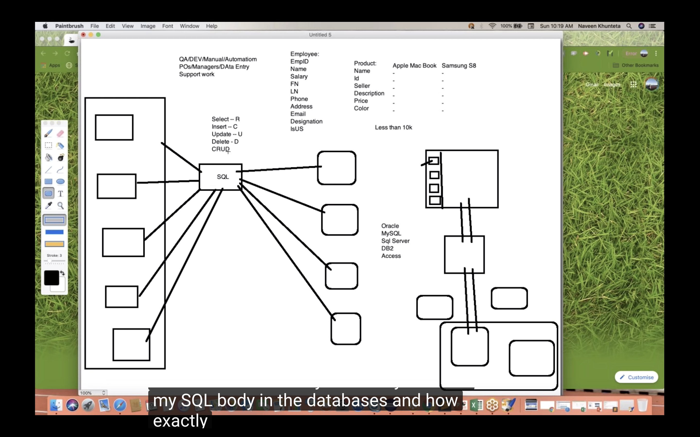

# SQL

# Part-1
Basic handson SQL

Naveen SQL

SQL - Structured Query Language

NO SQL - cassandra,MongoDB,CouchDB

[PlayList](https://www.youtube.com/playlist?list=PLFGoYjJG_fqqZy9yuDVIO-2AppE60B4AS)

[OnlineCompiler](https://www.jdoodle.com/)

# Query

create table calc(x int, y int);

insert into calc values(10, 25);

select x,y, (x+y) from calc;
__________________________________________________

DB Table Schema
Column data types

__________________________________________________

# To Create Table

create table Employee(

    EmpID varchar(255),
    
    EmpName varchar(255),
    
    Age int,
    
    PhoneNumber int,
    
    EmailID varchar(255),
    
    Address varchar(255)
    
);

__________________________________________________

# To Insert data/Values into table

insert into Employee values(1, "Tom", 25, 9890000000, "tom@gmail.com", "1, hollywood avenue,LA");

insert into Employee values(2, "Steave", 35, 9890000000, "steave@gmail.com", "20, 2nd street ,SFO");

insert into Employee values(3, "Peter", 45, 9890000000, "peterdsouza@gmail.com", "villa house ,NY");

insert into Employee values(4, "Peter", 55, 9890000001, "peterparker@gmail.com", "villa house ,NY");

insert into Employee values(2, "Steave", 35, 9890000000, "steave@gmail.com", "20, 2nd street ,SFO");

__________________________________________________

# To Retrieve all data from Table

# "*" Means all the data

select * from Employee;

__________________________________________________

# To Get Count of rows

select count(*) from Employee;

__________________________________________________

# Filter : Where

select * from Employee where EmpName="Tom";

__________________________________________________

# For Comment in Doodle cmd+/

select  * from Employee Where Age in 31

__________________________________________________

# And operator both of them

select * from Employee where EmpName="Peter" and Age=45;

select * from Employee where Age>25;

select * from Employee where Age>25 and EmpName="Peter";

select * from Employee Where Age >25

select * from Employee Where Age >25 and EmpName="Harry"

__________________________________________________

# OR operators Either of them

select * from Employee where Age>46 and EmpName="Peter";

select * from Employee Where Age >25 or EmpName="Harry"

select count(*) from Employee Where Age >25 and EmpName="Harry"

select count(*) from Employee Where Age >25 or EmpName="Harry"

__________________________________________________

# Distinct: avoid duplicates values only unique value

# if any duplicate row and you call select * from Employee; then duplicate row also display how to avoid?

select distinct * from Employee;

select distinct count(*) from Employee;

select count(distinct EmpID) from Employee;

select count(distinct EmpName) from Employee;

__________________________________________________

# Part - 2

create table Employee(

    EmpID varchar(255),
    
    EmpName varchar(255),
    
    Age int,
    
    PhoneNumber int,
    
    EmailID varchar(255),
    
    Address varchar(255)
    
);

 insert into Employee values(10, "Tom", 25, 9890000000, "tom@gmail.com", "1, hollywood avenue,LA");

 insert into Employee values(12, "Steave", 35, 9890000000, "steave@gmail.com", "20, 2nd street ,SFO");

 insert into Employee values(32, "Peter", 45, 9898000000, "peterdsouza@gmail.com", "villa house ,NY");

 insert into Employee values(14, "Peter", 55, 9890000001, "peterparker@gmail.com", "villa house ,NY");

 insert into Employee values(15, "John", 43, 9890000030, "john@gmail.com", "20, 3nd street ,SFO");

 select * from Employee;

 select count(*) from Employee;

select * from Employee where EmpName="Tom";

 __________________________________________________
 # And operator: both of them True
 
select * from Employee where EmpName="Peter" and Age=45;

select * from Employee where Age>25;

select * from Employee where Age>25 and EmpName="Peter";

__________________________________________________

# Or operators:Either of them True

select * from Employee where Age>46 and EmpName="Peter";

# Distinct: To Avoid duplicates values only unique value Print

# if any duplicate row and you call select * from Employee; then duplicate row also display how to avoid?

select distinct * from Employee;

select distinct count(*) from Employee;

select count(distinct EmpID) from Employee;

select count(distinct EmpName) from Employee;

__________________________________________________

# Ordered By

select * from Employee order by EmpID;

__________________________________________________

# Ascending order

 select * from Employee order by EmpID ASC;
 
 __________________________________________________

# Descending order

select * from Employee order by EmpID DESC;

select * from Employee order by Age DESC;

select * from Employee order by Age;
 
 __________________________________________________

# what return first take that In this EmpName take first

 select * from Employee order by EmpName,Age;

 select * from Employee where Age >26 and EmpId >10;

 select * from Employee where Age >20 or EmpId >10;

 select * from Employee where Age >26 and EmpId >10 and PhoneNumber=9898000000;

 select * from Employee where Age >26 and Age< 56;
 

create table Customer

(

    ID int,
    
    Name varchar(255),
    
    PhoneNumber int,
    
    EmailID varchar(255),
    
    Country varchar(255),
    
    City varchar(255)
    
);

insert into Customer values(10, "Tom", 1234567890, "a@gmail.com", "USA", "LA");

insert into Customer values(20, "Tommy", 1234567891, "b@gmail.com", "USA", "NY");

insert into Customer values(30, "Thomas", 1234567892, "c@gmail.com", "IND", "AHD");

insert into Customer values(40, "Steve", 1234567893, "d@gmail.com", "UK", "LD");

insert into Customer values(50, "Peter", 1234567894, "e@gmail.com", "CA", "OT");

insert into Customer values(60, "John", 1234567895, "f@gmail.com", "NZ", "ABC");

 select * from Customer;

 select * from Customer Where Country = "USA";

 select * from Customer Where Country = "USA" OR Country ="UK"; 

__________________________________________________

# NOT keyword
 select * from Customer Where NOT Country = "USA";

 select * from Customer where Country = "USA" and (City="LA" or City="NY");

 select * from Customer where Country = "IND" and Not Country = "USA";

 
# Part - 3
